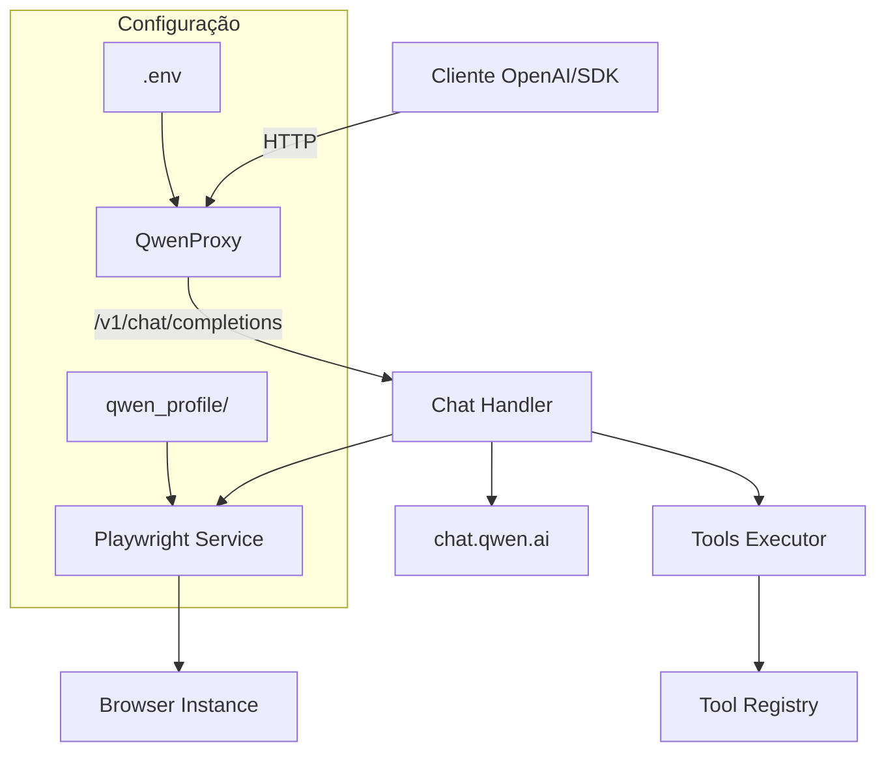

# QwenProxy

Proxy API local compatível com OpenAI que roteia requisições para os modelos do **Qwen (chat.qwen.ai)** via automação de navegador com Playwright. Oferece suporte a execução de ferramentas, modo de pensamento (reasoning) e persistência de sessão.

[](https://github.com/pedrofariasx/qwenproxy/actions/workflows/ci.yml)
[](https://www.typescriptlang.org/)
[](https://hono.dev/)
[](https://playwright.dev/)
[](LICENSE)

---

## ✨ Features

- **OpenAI API Compatible**: Interface compatível com `/v1/chat/completions` e `/v1/models`.
- **Reasoning Support**: Suporte completo ao modo de pensamento (thinking) dos modelos Qwen.
- **Tool Execution**: Sistema de execução de ferramentas locais integrado ao fluxo do chat.
- **Session Persistence**: Login persistente com armazenamento de perfil do navegador em `qwen_profile/`.
- **Network Visibility**: Exibe URLs local e de rede (IP) ao iniciar o servidor.
- **Browser Selection**: Escolha entre Chrome, Firefox, Edge ou Chromium para execução.
- **Docker Ready**: Deploy simplificado com suporte a Docker e Docker Compose.
- **Auto-Login**: Login automático via credenciais `.env` com recuperação de sessão.
- **Stream Options**: Suporte a `include_usage` em streaming responses.

---

## 🏗️ Arquitetura



---

## 📋 Pré-requisitos

| Dependência | Versão Mínima | Instalação |
|------------|--------------|-----------|
| Node.js | v20.x | [nvm](https://github.com/nvm-sh/nvm) |
| npm | v9.x | Incluído com Node.js |
| Playwright | - | `npx playwright install` |
| Docker (opcional) | v24.x | [Docker Docs](https://docs.docker.com/get-docker/) |

---

## 🚀 Instalação

### Via npm

```bash
# Clonar repositório
git clone https://github.com/pedrofariasx/qwenproxy.git
cd qwenproxy

# Instalar dependências
npm install

# Instalar browsers do Playwright
npx playwright install
```

### Via Docker

```bash
# Iniciar containers
docker-compose up -d
```

---

## ⚙️ Configuração

Crie o arquivo `.env` na raiz do projeto:

```env
# Porta do servidor (default: 3000)
PORT=3000

# Chave de API para proteger os endpoints (opcional)
API_KEY=sua-chave-secreta-aqui

# Credenciais Qwen (para login automático)
QWEN_EMAIL=seu-email@exemplo.com
QWEN_PASSWORD=sua-senha-aqui

# Navegador padrão (chromium, firefox, chrome, edge)
BROWSER=chromium
```

---

## 📡 Uso e Comandos

### Inicialização do Servidor

```bash
# Iniciar com o navegador padrão (Chromium)
npm start

# Iniciar com navegadores específicos
npm run start:chrome
npm run start:firefox
npm run start:edge
```

Ao iniciar, o console exibirá:
```txt
🚀 QwenProxy started!
- Local:   http://localhost:3000
- Network: http://192.168.1.10:3000

Available Routes:
- [GET] /health
- [POST] /v1/chat/completions
- [GET] /v1/models
```

### Autenticação de Sessão (Login)

Se não usar credenciais no `.env`, realize o login manual:
```bash
npm run login
# Ou com browser específico
npm run login:firefox
```

---

## 📡 API Reference

### Chat Completions

```http
POST /v1/chat/completions
Content-Type: application/json
Authorization: Bearer sua-chave
```

**Modelos Suportados**:
- `qwen-plus`: Modelo padrão com raciocínio habilitado.
- `qwen-plus-no-thinking`: Versão sem o bloco de pensamento.
- `qwen-max`, `qwen-turbo`, etc. (conforme disponibilidade na conta).

---

## 💻 Exemplos de Integração

### OpenAI SDK (Node.js)

```typescript
import OpenAI from 'openai';

const openai = new OpenAI({
  baseURL: 'http://localhost:3000/v1',
  apiKey: process.env.API_KEY || 'sk-no-key-required'
});

const completion = await openai.chat.completions.create({
  model: 'qwen-plus',
  messages: [{ role: 'user', content: 'Explique como funciona o Playwright.' }]
});

console.log(completion.choices[0].message.content);
```

---

## 📁 Estrutura do Projeto

```
qwenproxy/
├── src/
│   ├── index.ts              # Entry point e servidor Hono
│   ├── routes/
│   │   └── chat.ts          # Handler compatível com OpenAI
│   ├── services/
│   │   ├── qwen.ts          # Integração com a API do Qwen
│   │   └── playwright.ts    # Automação de navegador
│   ├── tools/
│   │   ├── executor.ts      # Execução de ferramentas
│   │   └── registry.ts      # Registro de tools
│   └── login.ts             # Script de autenticação
├── qwen_profile/            # Armazenamento da sessão (gitignored)
├── Dockerfile                # Configuração Docker
└── package.json             # Scripts e dependências
```

---

## 🔍 Troubleshooting

- **Endereço em uso**: Verifique se a porta `3000` está livre ou altere o `PORT` no `.env`.
- **Erro de Navegador**: Se um navegador não abrir, certifique-se de que ele está instalado (`npx playwright install`).
- **Sessão Expirada**: Execute `npm run login` novamente para renovar os cookies.

---

## ⚠️ Disclaimer

> Este projeto é fornecido estritamente para fins educacionais e de pesquisa.

Os autores não incentivam ou endossam:
- Violação dos Termos de Serviço da plataforma Qwen.
- Automação não autorizada em larga escala.
- Uso para atividades maliciosas.

**Use por sua conta e risco.**
